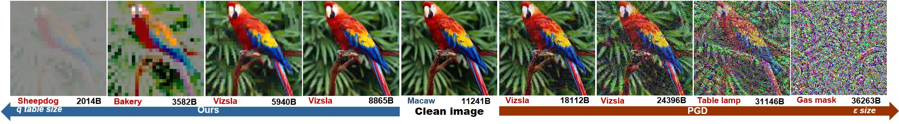
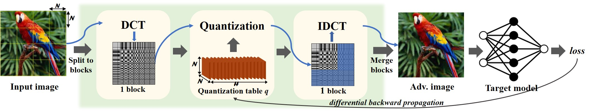
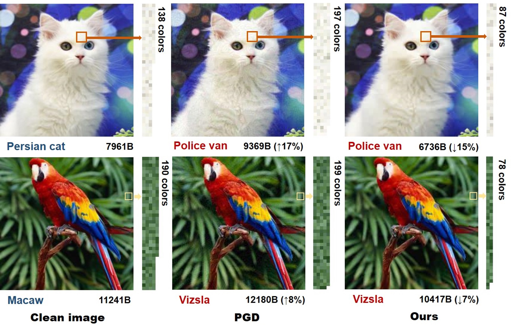

# AdvDrop
Code for "AdvDrop: Adversarial Attack to DNNs by Dropping Information(ICCV 2021)."
<p align='center'>
  
</p>
Human can easily recognize visual objects with lost information: even losing most details  with only contour reserved, e.g. cartoon. However, in terms of visual perception of Deep Neural Networks (DNNs), the ability for recognizing abstract objects (visual item with lost information) is still a challenge. In this work, we investigate this issue from an adversarial viewpoint: will the performance of DNNs decrease even for the images only losing a little information? 
Towards this end, we propose a novel adversarial attack, named AdvDrop, which crafts adversarial examples by dropping existing information of images.
Previously, most adversarial attacks add extra disturbing information on clean images explicitly. Opposite to previous works, our proposed work explores the adversarial robustness of DNN models in a novel perspective by dropping imperceptible details to craft adversarial examples.
<p align='center'>
  
</p>
[Paper link](http://arxiv.org/abs/2108.09034)

## Installation

We highly recommend using [conda](https://www.anaconda.com/distribution/).
```sh
conda create -n advdrop_env python=3.7
source activate advdrop_env
```
After activating the virtual environment, install pytorch, numpy and torchattacks with:
```sh
pip install --user [the package name]
```
Download [dataset](https://drive.google.com/file/d/1JcFFt-T0HtvqFmOUMOqX4UD6uG0KiH0L/view?usp=sharing).

## Usage
#### Quick Start
```sh
python infod_sample.py
```
* Parameters can be speicified in infod_sample.py.

## An example

#### Adv Images
<p align='center'>
  
</p>


## Acknowledgments
* We refered [Michael's code](https://github.com/mlomnitz/DiffJPEG) for JPEG (torch version) part.
* We referred [Harry's code style] (https://github.com/Harry24k/adversarial-attacks-pytorch)

## Citation
```

```
